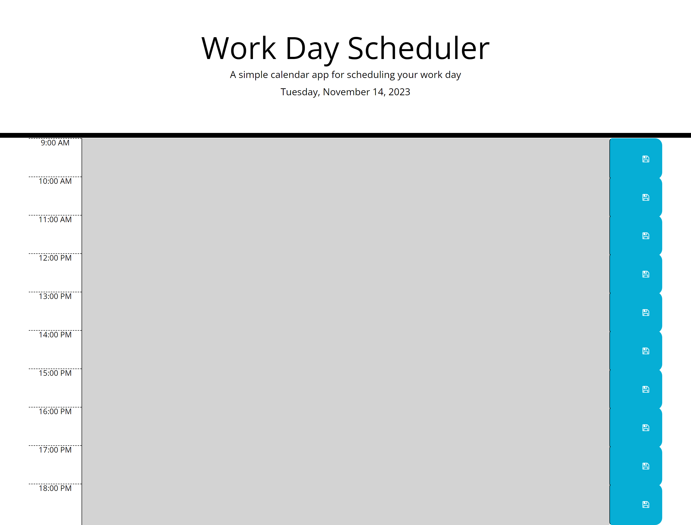

# Daily-Planer-App
I have create a simple daily planner app that records and allows me to save events for each hour of the day from 9am-6pm. The hours past are highlighted in grey, the current hour is highlighted in red and the future hours are highlihted in green. You can save the events you want to do by clicking on the save button and they will remain in the daily planner.

## Installation

This app will run in the browser using HTML, CSS, JavaScript and Jquery.

    
## Screenshots

## Deployment

To deploy this project run

- https://cdn.jsdelivr.net/npm/dayjs@1/dayjs.min.js
- https://cdnjs.cloudflare.com/ajax/libs/jquery/3.2.1/jquery.min.js

website - https://yusufdev15.github.io/Daily-Planner-App/

## Credits

- https://help.syncfusion.com/js/datetimepicker/display-format 
- https://zetcode.com/javascript/dayjs/?utm_content=cmp-true 
- https://developer.mozilla.org
- https://edabit.com/challenge/ARr5tA458o2tC9FTN
- https://developer.mozilla.org/en-US/docs/Web/API/Element/removeAttribute
- https://developer.mozilla.org/en-US/docs/Web/API/Element/keyup_event
- https://www.w3schools.com/jsref/dom_obj_all.asp
- https://fontawesome.com/
- https://jquery.com/
- 1 to 1 with a tutor 

## License

[MIT](https://choosealicense.com/licenses/mit/)

